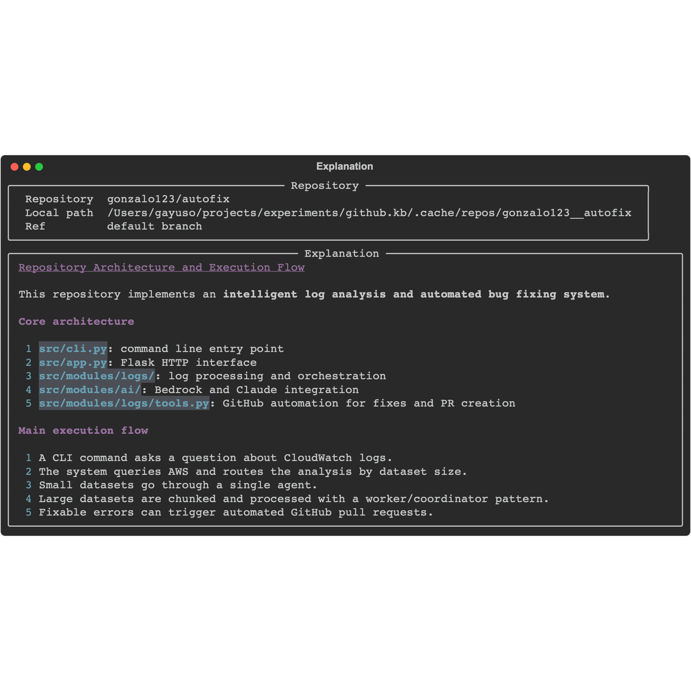
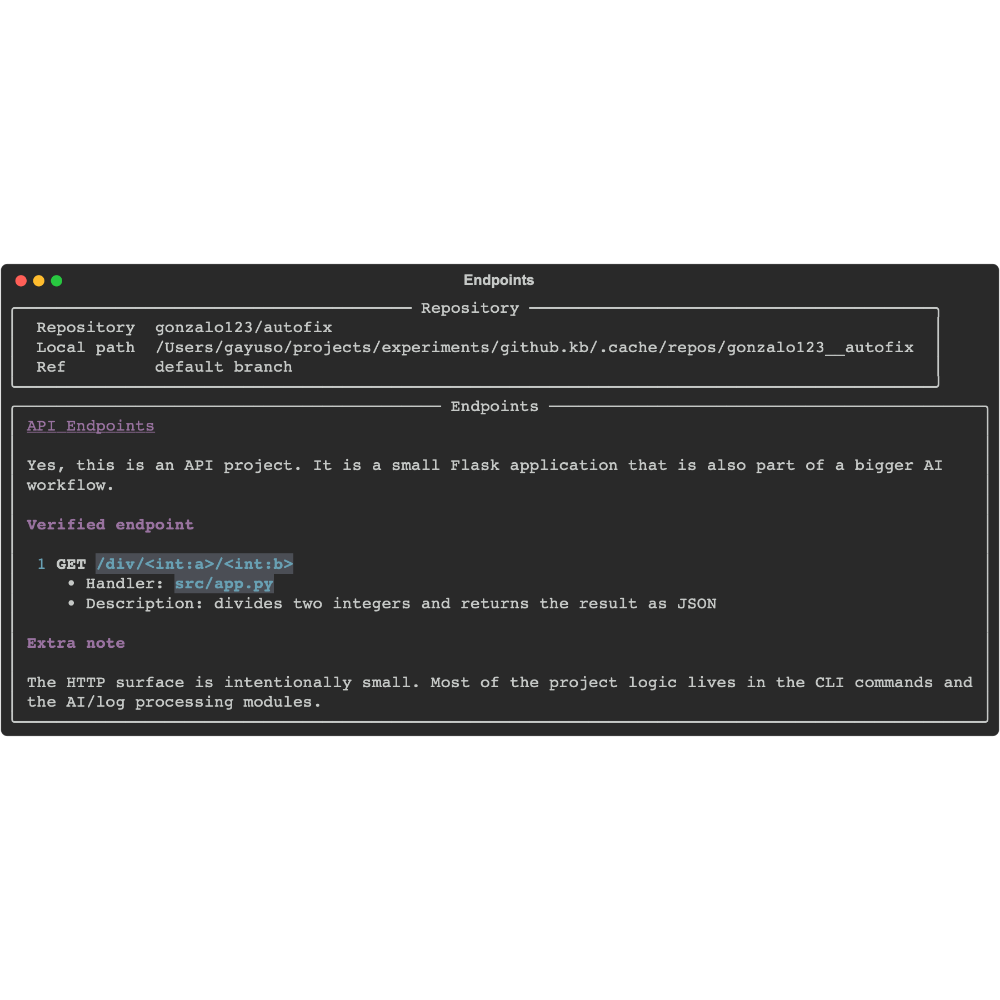
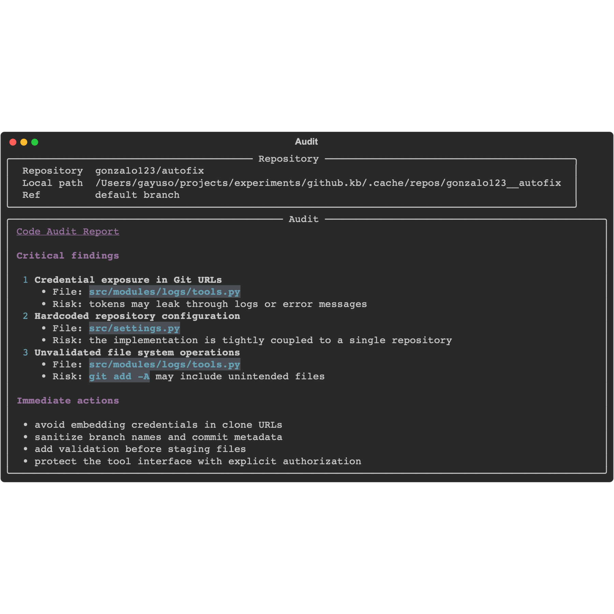

# What if you could ask questions to any GitHub repository? Building a repository-aware AI agent with Python, Strands Agents, and Bedrock

Sometimes we land on an unfamiliar GitHub repository and the first problem is not writing code. The real problem is understanding the project fast enough. Is this a REST API? Where are the entrypoints? How is the application wired? Are there obvious risks in the codebase? If the repository is big enough, answering those questions manually is slow and boring.

That's just my PoC. An interactive command-line application that can inspect any public GitHub repository and answer questions about it.


I have the feeling this workflow should exist natively on GitHub. Once repositories become large enough, being able to ask architecture, audit, or API questions feels like a natural evolution of code search and Copilot. Maybe the reason it does not exist yet is cost, scope, or product complexity. In the meantime, a CLI-first open source approach feels like a good place to start: simple, scriptable, hackable, and based on bring-your-own-model credentials so each user keeps control of their own usage and billing.

The idea is simple. We give a GitHub repository to a CLI application. The CLI creates a local checkout, exposes a small set of repository-aware tools to a Strands Agent, and lets the agent inspect the project with AWS Bedrock. Because the agent can list directories, search code and read files, we can ask practical questions such as:

- Explain how the project works
- Audit the codebase looking for risks
- List the API endpoints
- Describe the execution flow of a specific module

This is not a vector database project and it is not a RAG pipeline. It is a much simpler approach. We let the agent explore the repository directly, file by file, using tools.

## The architecture

The flow is straightforward:

1. The user calls the CLI with a GitHub repository.
2. The repository is cloned into a local cache.
3. A Strands Agent is created with a Bedrock model.
4. The agent receives a system prompt plus four tools:
   `get_directory_tree`, `list_directory`, `search_code` and `read_file`.
5. The agent inspects the repository and returns the final answer in Markdown.

This is enough for a surprising number of use cases. If the system prompt is focused on architecture, the answer becomes an explanation. If the prompt is focused on risk, the answer becomes a code audit. If the prompt is focused on HTTP routes, the answer becomes an API inventory.

## Project structure

I like to keep configuration in `settings.py`. It is a pattern I borrowed years ago from Django and I still use it in small prototypes because it keeps things simple:

```text
src/
└── github_kb/
    ├── cli.py
    ├── settings.py
    ├── commands/
    │   ├── ask.py
    │   ├── audit.py
    │   ├── chat.py
    │   ├── endpoints.py
    │   └── explain.py
    ├── lib/
    │   ├── agent.py
    │   ├── github.py
    │   ├── models.py
    │   ├── prompts.py
    │   ├── repository.py
    │   └── ui.py
    └── env/
        └── local/
            └── .env.example
```

The responsibilities are small and explicit:

- `github_kb/commands/` contains the Click commands.
- `github_kb/lib/github.py` resolves the GitHub repository and manages the local checkout.
- `github_kb/lib/repository.py` contains the repository exploration logic used by the agent tools.
- `github_kb/lib/agent.py` wires Strands Agents with AWS Bedrock.
- `github_kb/lib/prompts.py` keeps the system prompt and the task-specific prompts in one place.

## Why this works

Large repositories are difficult because we rarely need the whole repository at once. We normally need a guided exploration strategy. A tree view helps us identify the shape of the project. Search helps us jump to the interesting files. Reading files gives us the final confirmation.

That sequence maps very well to tool-based agents.

Instead of trying to send the whole repository in one prompt, the model can progressively inspect only the relevant parts. It is cheaper, easier to reason about, and much closer to how we inspect an unknown codebase ourselves.

## Install

The intended installation flow is:

```bash
pipx install github-kb
```

## Quick start

The happy path should look like this:

```bash
aws sso login --profile sandbox
AWS_PROFILE=sandbox AWS_REGION=us-west-2 github-kb doctor
AWS_PROFILE=sandbox AWS_REGION=us-west-2 github-kb chat gonzalo123/autofix
```

The CLI is designed to work out of the box with the standard AWS credential chain. That means it can use:

- `AWS_PROFILE`
- `AWS_REGION`
- `aws sso login`
- regular access keys if they are already configured in the environment

By default, `github-kb` uses `global.anthropic.claude-sonnet-4-6` unless `BEDROCK_MODEL_ID` or `--model` says otherwise.

You can also override the runtime explicitly with CLI flags such as `--aws-profile`, `--region`, and `--model`.

## Usage

Now we can ask questions:

```bash
github-kb ask gonzalo123/autofix "How does the automated fix flow work?"
github-kb chat gonzalo123/autofix
github-kb explain gonzalo123/autofix --topic architecture
github-kb audit gonzalo123/autofix --focus github
github-kb endpoints gonzalo123/autofix
github-kb doctor
```

If we want to keep the same conversation alive across multiple questions in one terminal session:

```bash
github-kb chat gonzalo123/autofix
```

It also accepts full GitHub URLs:

```bash
github-kb ask https://github.com/gonzalo123/autofix "Where is the application bootstrapped?"
```

If we want to refresh the local cache:

```bash
github-kb audit gonzalo123/autofix --refresh
```

We can also pass the AWS runtime explicitly:

```bash
github-kb chat gonzalo123/autofix --aws-profile sandbox --region eu-central-1
github-kb ask gonzalo123/autofix "Explain the architecture" --model global.anthropic.claude-sonnet-4-6
```

## Demo screenshots

Here are a few real screenshots generated against one of my own repositories, [`gonzalo123/autofix`](https://github.com/gonzalo123/autofix).

The screenshots below are embedded as PNG files:

### `explain`



### `endpoints`



### `audit`



## A couple of notes

This is still a PoC. The goal is not to build a perfect repository analysis platform. The goal is to validate a simple idea: an agent with a tiny set of well-chosen tools can already be useful for code understanding.

There are several obvious next steps:

- add more repository-aware tools
- persist analysis sessions
- summarize previous findings before starting a new question
- support GitHub authentication for private repositories
- add specialized prompts for security reviews or framework-specific inspections

Even in its current state, it is already a nice example of how tool-based agents can help with a very real developer problem.
